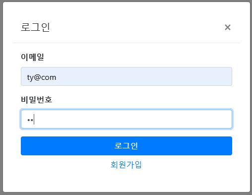
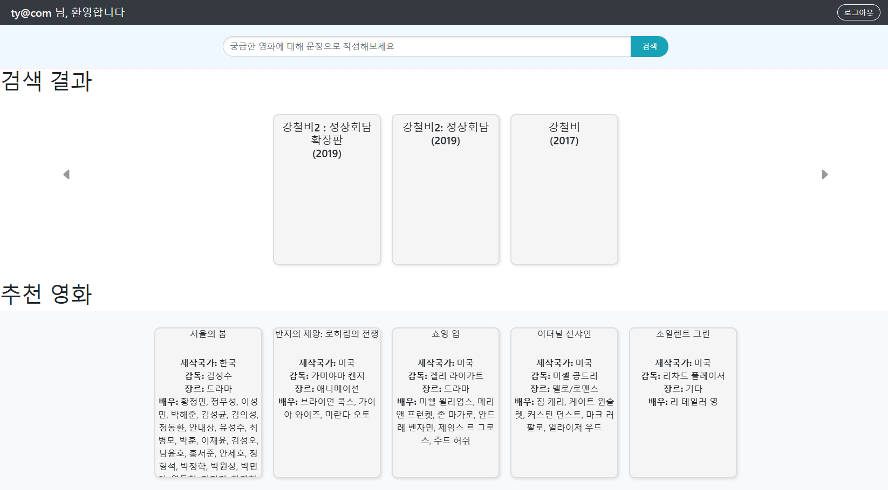
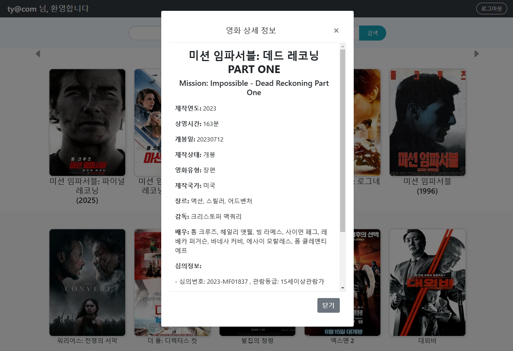

# recommend_movie
LLM 기반 영화 추천 프로그램

## 팀원
- 책임자, 코더 : 안채연
- LLM 연동 담당, 어드바이저 : 조영훈
- 장소 : 성남 세종교육 AIoT 7월반

## 개요
- 배경 : 기본 검색창에서 부가적인 정보만으로 영화를 찾으면 사용자가 원하는 결과가 쉽게 나오지 않는다.
- 목적 : 사용자가 입력한 키워드를 바탕으로 관련 영화들을 분석, 검색, 추천하는 시스템을 구현하고자 한다. 

## 일정
1. 기획 및 일정 수립 20241206
2. 개발환경 구축
3. 데이터 수집 및 데이터베이스 연동
4. LLM 활용
5. 뷰페이지 작성 및 웹 크롤링
6. 기능 테스트 및 배포
7. 프로젝트 종료 20250117

## 목표 (시스템 구조 및 기술 스택)
- 구성 요소 : 영화 검색 사이트, LLM API, 회원관리, 영화 종합 정보 사이트 크롤링
- 데이터 흐름 : 키워드 입력 -> LLM 분석 -> DB 조회 및 크롤링 -> 결과 정렬 및 필터링 -> 사용자 제공 
- 기술 스택 : python(fast api), html5, mysql, ~~spring boot(초보자가 접근하기 어려운 기술이고 잦은 오류와 개발 딜레이로 인해 fast api 로 전환하였음.)~~ , 정보사이트 api, llama 3.1
- LLM 모델 : https://huggingface.co/MLP-KTLim/ma-3-Korean-Bllossom-8B
- llama 3.1 about: https://www.llama.com/docs/model-cards-and-prompt-formats/llama3_1

## 개발 환경 및 자료 출처 
- 운영 체제 : windows 11 pro, ubuntu(mysql, LLM api server)
- 개발 언어 : python, html5
- 편집기 : visual studio code
- 버전 관리 : github https://github.com/business-sixtick/recommend_movie
- 데이터베이스 : mysql 
- 영화 종합 검색 사이트 : https://www.kobis.or.kr/kobisopenapi/homepg/main/main.do
- html5 library : https://getbootstrap.com/

## 후기 (기대 효과 및 확장 가능성)
- 기대 효과 : 사용자 영화 탐색 경험 향상, 빠르고 정확한 영화 추천으로 시간 절약, 최신 트렌드 및 개인화된 정보 제공
- 확장 가능성 : OTT 구독 및 현재 상영 영화 예매 연동, 스프링 부트 또는 플러터로 개발, 검색 결과 카드에 이미지 삽입, 좋아요 기능
- 한계 및 어려움 : 장비의 한계로 llama 3.1 8B 이상의 모델을 쓸 수가 없음. 

## 개발 결과 및 이미지 
- 로그인화면

- 검색 결과 

- 결과 상세 

